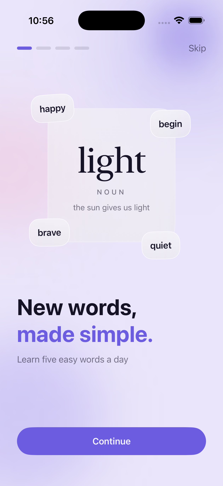
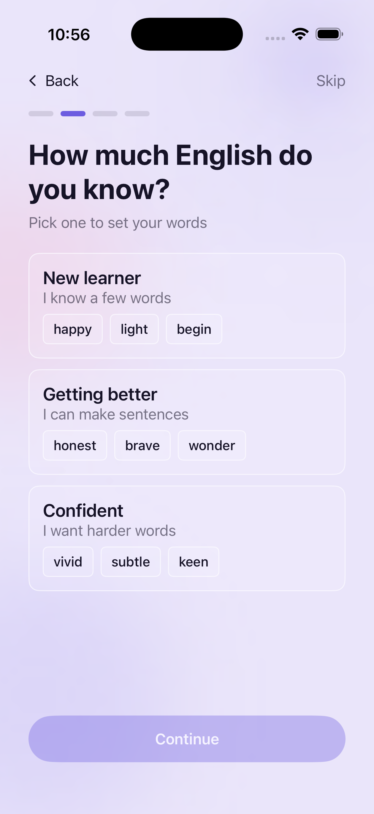
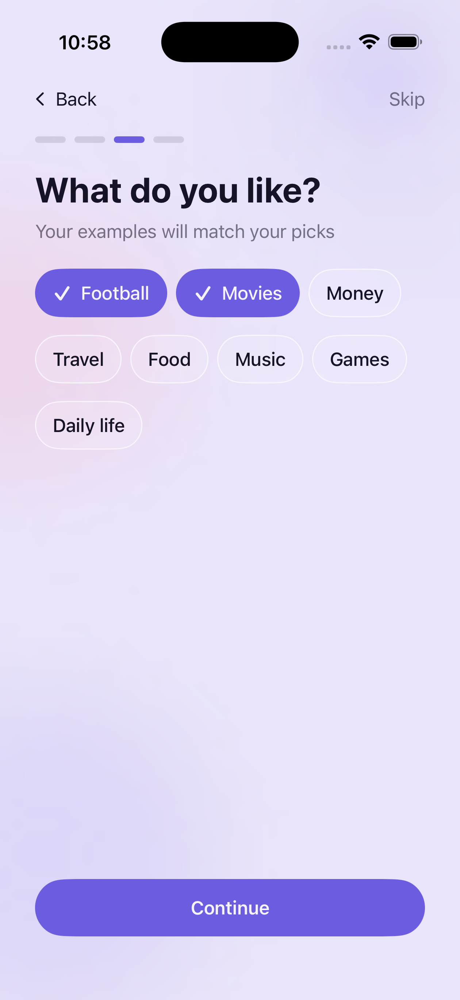
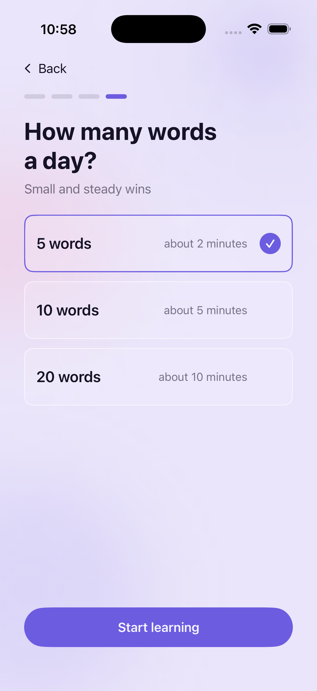
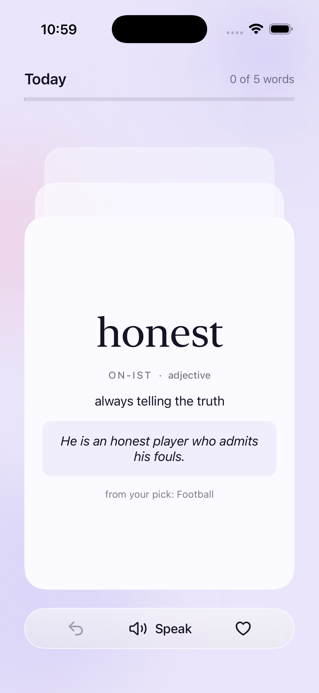

# Spoken

Rebuild of Vocabulary's onboarding and home swipe flow. SwiftUI, iOS 17.

| Welcome | Level | Interests | Daily goal | Home |
|---|---|---|---|---|
|  |  |  |  |  |

## Running it

Xcode 15+. Open `Spoken.xcodeproj`, run. No packages, no configuration.

## Architecture

A single app target, with folders rather than Swift packages marking the boundaries between the
design system, the core models and the two flows. The seams are protocols injected through `init`:
`WordsLoader` supplies the vocabulary, `SettingsStore` keeps the learner's choices, and neither has
a singleton behind it, so any screen can be built with a stand-in. Views follow MVVM with
`@Observable` view models that hold state and never navigate; onboarding is driven entirely by an
`OnboardingStep` enum rather than a navigation stack, which is what keeps the Continue button in
exactly the same place on all four screens. There are no third-party dependencies, and the whole
interface is drawn in code, with no image assets in the bundle.

## Design decisions

- iOS 17 as the minimum, for `.sensoryFeedback` and `PhaseAnimator`.
- Glass is reserved for floating layers, per Apple's guidance: the welcome hero and the home
  actions bar. Content surfaces are tinted, never material.
- Light mode is locked, and every screen sits on the same ambient orb background.
- The swipe haptic fires at the commit threshold, while the finger is still down, rather than on
  release, so the swipe is confirmed before you let go. This is the Squad Busters pattern.
- Motion is quiet by design: no bounce, no scaling, and every animation degrades to a crossfade
  under Reduce Motion.

## Personal touch

**A swipe you can take back.** A light, accidental drag should not count as a real answer, but on a
card stack it usually does: the word slides away and the learning moment is gone with it. Two things
fix that, and both are here. The commit threshold is firm, a third of the card's width, and a light
haptic fires the moment the drag crosses it, while the thumb is still down, so you learn where the
line is before you let go. Anything short of it springs back. And when one does get away, Undo
restores the card and rolls the day's count back with it.

**Onboarding answers that visibly change the content.** Onboarding that asks several questions and
then shows everyone the same words reads as friction rather than personalisation, because nothing
proves the answers landed. The proof here is the examples. Every sentence on a card is drawn from an
interest you picked, and carries a small tag naming it, so a learner who chose Football reads
"The brave player stayed calm." under `from your pick: Football` — the answer given two screens
earlier, visible in the thing being read now.

## Accessibility

Dynamic Type through to AX5, VoiceOver cards grouped into a single element with custom actions, and
Reduce Motion honoured throughout.
